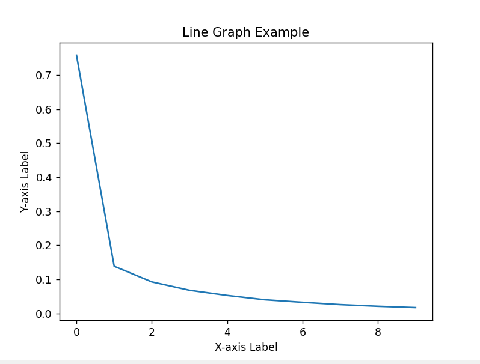
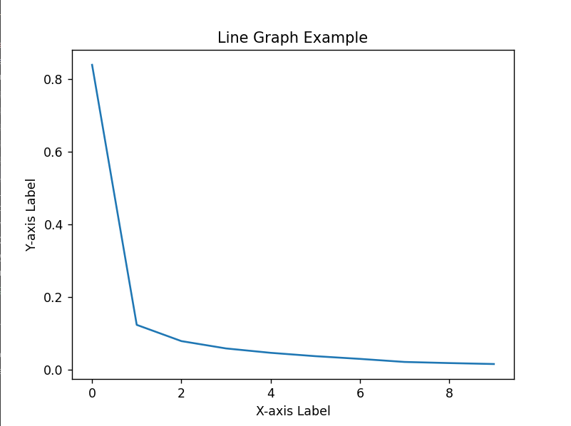
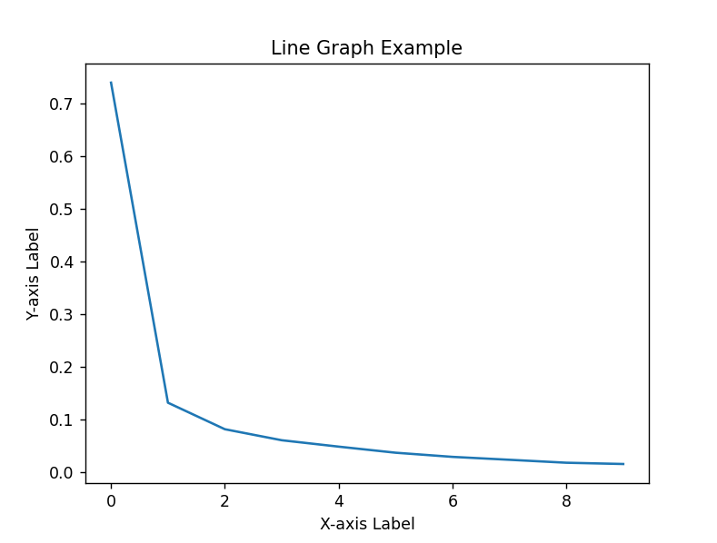
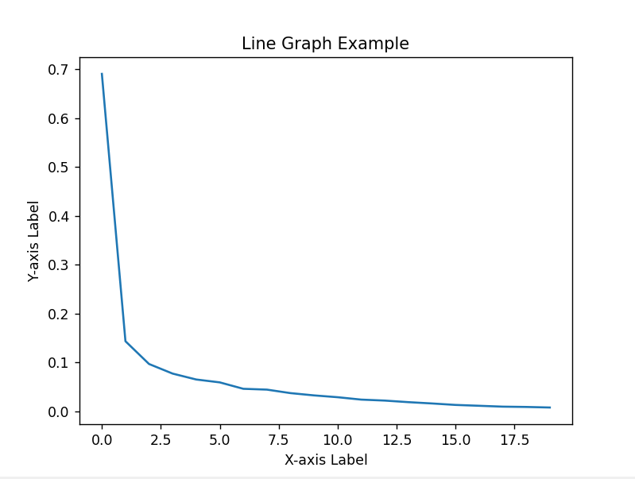

# OPTIMIZING MOE and Comparing Performance

###### NOTE-

THIS MODEL ARCHITECHTURE IS READY TO BE IMPLEMENTED ON SEQUENCED DATA TYPE.

BUT,i was unable to import the model from hugging face as i have never worked with sequenced data so for this assignment i have used MOE on mnist dataset classification task.I know this going of track from the provided assignment but exploring the use of MOE for image classification i guess wont cause any harm to the society and probably help me gain some more insight.

## Aim

To study the effects of number of experts and experts size

## Goal

to achieve maximum accuracy in 10 epochs

## FineTuning

#### Meaning of different parameters

hidden_size_moe= refers to number of features in the hidden layer of the expert

num_experts =refers to the expert network initialized

top_k=number of experts that will be used to evaluate the result.

### Run 1

DRY RUN

'''moe hyperparameters'''

hidden_size_moe=256

num_experts=20

top_k=2#top k gates pass

for 9 epoch average loss is 0.017321780404927267
Accuracy on training set: 99.485847
Accuracy on test set: 99.14

observation-accuracy is pretty good but can be improved .

### Run 2

For this run i reduced the number of experts as 10 epochs felt very less to train large number of parameters.

'''moe hyperparameters'''

hidden_size_moe=256

num_experts=10

top_k=2#top k gates pass

for 9 epoch average loss is 0.01558819169531489
Accuracy on training set: 99.564308
Accuracy on test set: 99.35

observation- accuracy improved as well as the variance decreased.

### Run 3

i changed the number of experts to 5, to check if it will improve accuracy.

'''moe hyperparameters'''

hidden_size_moe=256

num_experts=5

top_k=2#top k gates pass

Accuracy on training set: 99.567642
Accuracy on test set: 99.16

observation accuracy on the test set dropped while training set was maintained indicating overfitting.

### Run 4-7

i tried expert number from 5 to 15 and found out that 10 (results in run 2) provided the best performace.

So in this run and onwards i started to alter the number of hidden features in the expert unit.

hidden_size_moe=512 (formerly 256)

num_experts=10

top_k=2#top k gates pass

for 9 epoch average loss is 0.015655694774977746
Accuracy on training set: 99.534264
Accuracy on test set: 99.37

observation-

 there is a fall in accuracy but the variance has significantly,so we can infer that increasing the number of hidden features in the expert layer captures more details. the accuracy on the training set can easily be increased by training it for more epochs thats not a problem.

### Run 8

i combine my observations from run 2 and run 7 and trained the model for 20 epochs.

for 19 epoch average loss is 0.006526055420977173
Accuracy on training set: 99.789665
Accuracy on test set: 99.28

observation -

model is still overfitting

### Run 9(Final Model)

in this run i implemented data augmentation to blur the training images a little to prevent overfitting and reduce variance EVEN MORE.

output_size_lstm=256

num_layers=1

learning_rate=5e-3

batch_size=256

num_epochs=20

'''moe hyperparameters'''

hidden_size_moe=512

num_experts=10

top_k=2#top k gates pass

for 19 epoch average loss is 0.007793799381715871
Accuracy on training set: 99.734581
Accuracy on test set: 99.31
